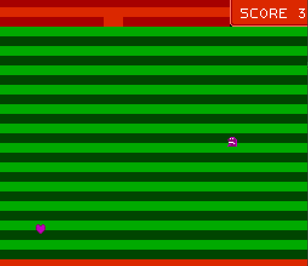

# NES 65002 programering

See [./docs](./docs) for information on nes programming

## Build and run

### Prerequisites

- **CC65 compiler**: Download from the [cc65 site](https://cc65.github.io/). Path must match the one specified in `./cl65config.json` (default is `C:/cc65`).
- **ca65 extension for vscode**: See recomended extensions
- **A nes emulator**: In order to run this project from vscode install [fceux-2.6.6](https://fceux.com/web/download.html) in the folder `C:/Program Files/fceux-2.6.6`

To build the project open `wrapper.s` and run the default build task in vs-code (`ctrl + shift + b`).

To run, execute the task `fceux64: run rom`
